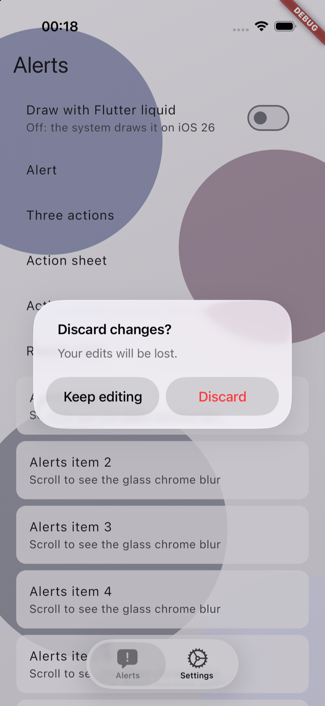
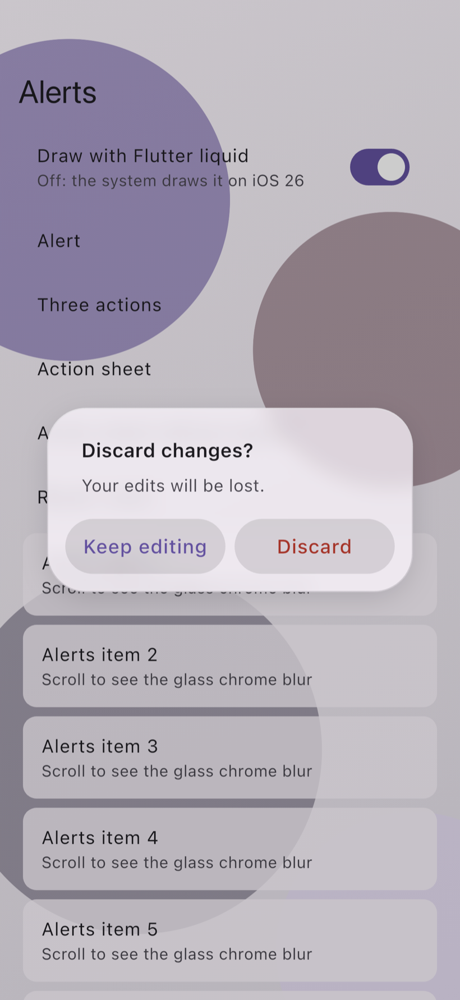
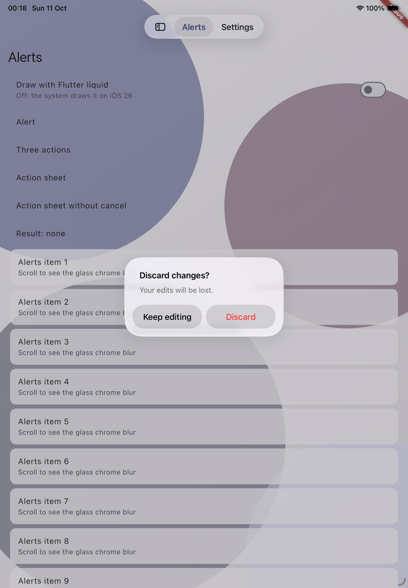
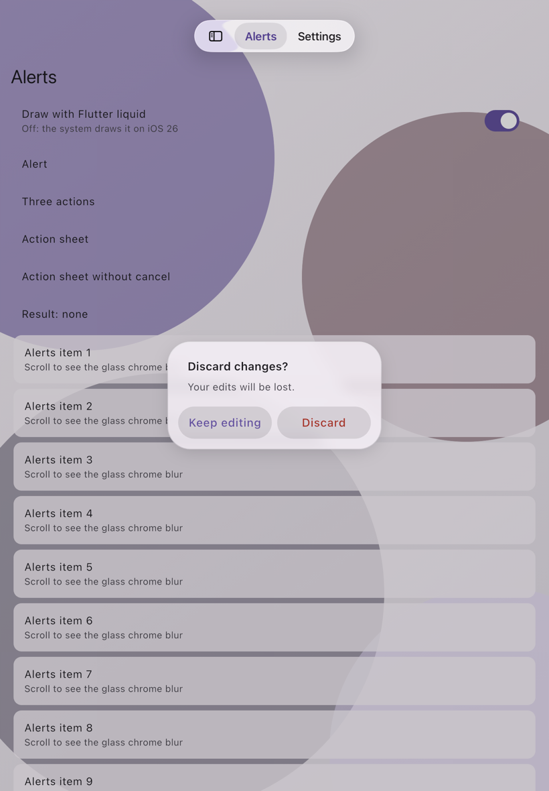
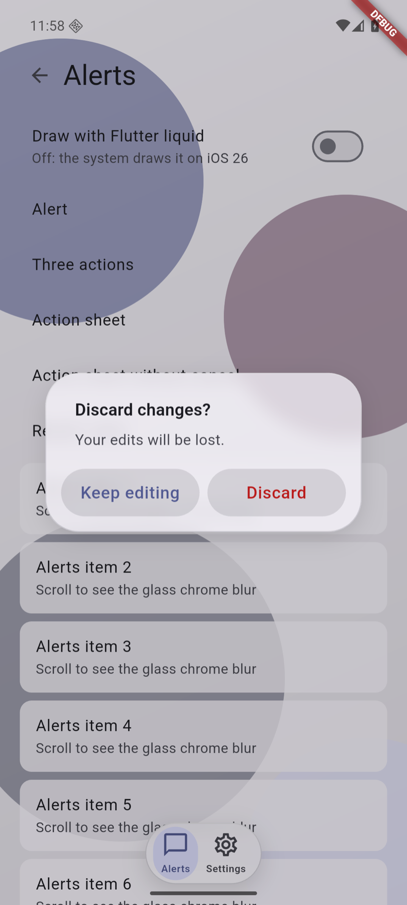
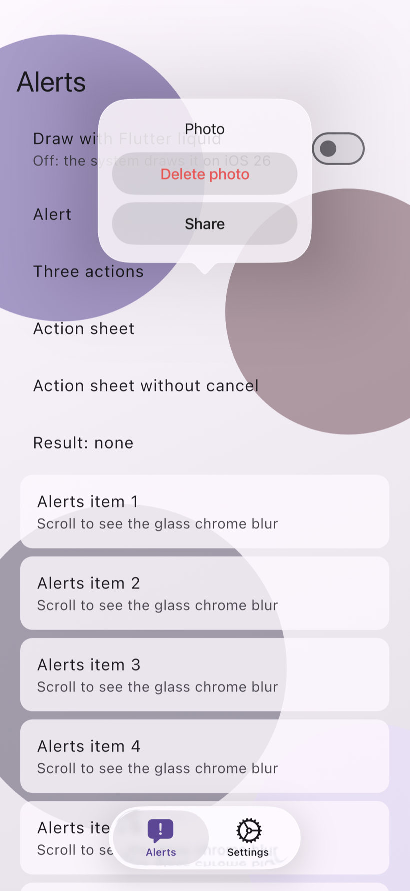
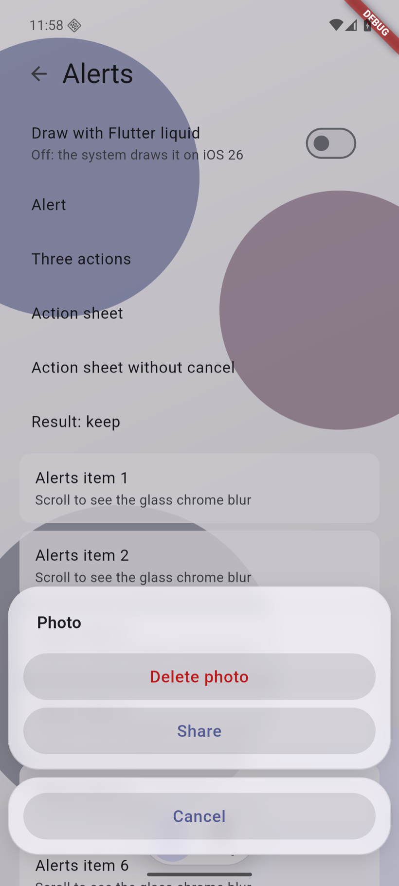
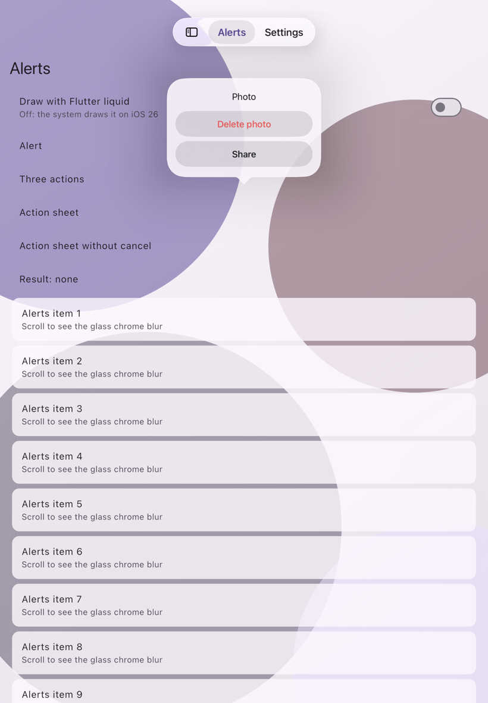

# P3a: side-by-side QA and manual checklist (VK-406 Task 8)

Simulators and the emulator only (2026-10-11): iPad Air 11-inch (M4) and
iPhone 17 Pro on iOS 26.5, an iPhone 17 Pro on iOS 27.0 (XCTest only), and
the Android emulator `tuvi_test` (`emulator-5554`, API 36). Every image is
820 px wide and losslessly recompressed (`tool/compress_pngs.dart`).

Where each image comes from:

- `ios26-*-alert-flutter.png`, `ios26-*-sheet.png`: `make
  integration-ios-native` (`native_dialogs_test.dart`, the example's
  "Alerts and action sheets" case, the sheet opened from its own button).
- `ios26-*-alert.png`, `ios26-iphone-alert-dark.png`,
  `ios26-iphone-alert-ax5.png`: `xcrun simctl io <udid> screenshot` of the
  debug example launched with `LIQUID_SHELL_EXAMPLE_DEMO=alert`, about 9 s
  after launch. The integration test's own native alert shot is taken while
  UIKit's appear animation is still running (the card is half transparent),
  so it is not used here.
- `android-*.png`: `adb exec-out screencap` of the debug example on the
  emulator, after a tap on "Alert" and on "Action sheet".

## Side by side

| | Native (UIKit, iOS 26.5) | Flutter glass |
|---|---|---|
| iPhone alert |  |  |
| iPad alert |  |  |
| Android alert | — |  |
| iPhone action sheet |  |  |
| iPad action sheet |  | `liquid_shell/doc/images/case_action_sheet.png` (golden: the anchored card) |

The compact Flutter sheet is the same widget on iOS < 26 and on Android,
so the Android capture stands for it.

### Verdict

- **Alert: close match.** Card width (320pt), corner radius, the two
  capsules side by side with the cancel action leading, and the title and
  message placement line up within a few points on both devices. Visible
  differences: the native standard and cancel labels are `labelColor`
  (black), the Flutter ones are `colorScheme.primary` (indigo), as spec
  §7.1 asks (divergence 1 of `metrics.md`); the native text is SF Pro, the
  Flutter text the theme's font; the Flutter barrier dims the page a
  little more.
- **Action sheet on iPhone: different by design.** iOS 26 presents the
  sheet as a popover from its button (240pt wide, no Cancel row; a tap
  outside answers the cancel value). The Flutter compact sheet is the
  bottom sheet of spec §7.2 with a separate Cancel capsule, which is what
  iOS < 26 and Android users expect. It does not look like the iOS 26
  native one.
- **Action sheet on iPad: match in kind.** Both are an anchored card
  without a Cancel row. The native popover's arrow stops about 20pt above
  the button; `native_dialogs_test.dart` checks that the source rect equals
  the button's rect (±0.5pt), so the gap is UIKit's.
- **Android:** the glass alert and sheet render as on iOS. Back on the
  alert answered "keep" (the cancel value, Q6).
- **Demo autorun anchor (example only):** with
  `LIQUID_SHELL_EXAMPLE_DEMO=sheet` on the iPad the popover points under
  the top bar, not at "Action sheet". The demo reads the button's rect in
  the first post-frame callback, before the native chrome has moved the
  body. The real tap path (above) is right.

## Manual checklist (spec §9.5)

Result: **pass** (checked here, on a simulator or the emulator), **fail**,
or **owner on device** (needs a real device or a GUI this run did not
have). The owner's boxes are left unticked.

| # | Check | How | Result |
|---|---|---|---|
| 1 | VoiceOver on the alert and the sheet | Accessibility Inspector on the simulator; then VoiceOver on device | **owner on device.** Partly covered: `make ios-ui` finds the alert and every button by accessibility label (`app.alerts["Discard changes?"].buttons["Discard"]`) and taps them, on iPad and iPhone. Spoken output and focus return were not checked (no GUI here) |
| 2 | Dynamic Type AX5 | `xcrun simctl ui <udid> content_size accessibility-extra-extra-extra-large` | **pass** (native): the alert grows and stacks Discard above Keep editing, cancel last ([ios26-iphone-alert-ax5.png](ios26-iphone-alert-ax5.png)). The Flutter alert at large text is pinned by widget tests (`alertActionsSideBySide`) |
| 3 | Dark mode | `xcrun simctl ui <udid> appearance dark` | **pass** (native): the alert is dark, following the app's dark theme ([ios26-iphone-alert-dark.png](ios26-iphone-alert-dark.png)) |
| 4 | RTL | the scheme's `-AppleLanguages (ar)` launch argument | **owner on device.** Launched with `-AppleLanguages (ar) -AppleLocale ar`: no change, because the example declares only English (`MaterialApp` without `supportedLocales`), so Flutter's `Directionality` stays LTR and the request says `rtl: false`. The `rtl` field is pinned by Dart tests; there is no XCTest with `rtl: true`. Needs an app with an RTL locale |
| 5 | Hardware keyboard Esc / Return | simulator with the Mac keyboard connected | **owner on device.** Not sent here (no GUI). The Flutter alert's Escape and Enter are pinned by widget tests |
| 6 | An alert while a Flutter `TextField` has the keyboard | trailing search page, type, then trigger an alert | **owner on device** |
| 7 | Guard alert from the iPad overlay sidebar | `native_shell_test.dart` on the iPad | **pass**: the log says `guard from LiquidChromeKind.sidebarOverlay`; the sidebar closes, then the native "Discard changes?" alert answers keep, then discard |
| 8 | Guard alert from the compact bar | `native_shell_test.dart` on the iPhone | **pass**: `guard from LiquidChromeKind.bottomBar`; the bar stays drawn under the native alert |
| 9 | Side-by-side shots, iPhone, iPad, Android | above | **pass** (see the verdict) |
| 10 | iOS < 26 (`auto` → Flutter glass, `system` → UIKit without glass) | Task 8 Step 4 | **unverified on a real iOS < 26 runtime (Q9).** Xcode 27.0 offers no iOS 18 runtime: `xcodebuild -downloadPlatform iOS -buildVersion 18.6` (and 18.0 to 18.5) answers "is not available for download". Covered by XCTest with the OS fact injected |

Owner, on device (iPhone and iPad, iOS 26 or later):

- [ ] VoiceOver reads the alert title, message and both buttons; after
      the alert closes, focus is back in the app.
- [ ] RTL in an app with an Arabic or Hebrew locale: the alert's buttons
      mirror.
- [ ] Hardware keyboard: Esc picks "Keep editing", Return picks the
      preferred action.
- [ ] Open the search page, type in the field, then trigger an alert:
      the keyboard and the field behave, and the field keeps focus after.
