# liquid_shell

Adaptive navigation shell with a Liquid Glass look for iOS and Android: a
floating glass tab bar on phones, a glass sidebar on tablets, and no router
dependency.

[](https://pub.dev/packages/liquid_shell)
[](https://github.com/anvu69/liquid_shell/actions/workflows/ci.yaml)
[](LICENSE)

| | iPhone | iPad landscape | Android |
|---|---|---|---|
| Light | 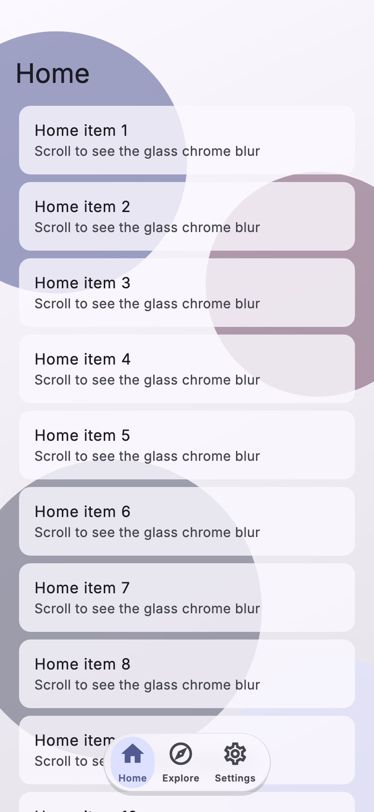 | 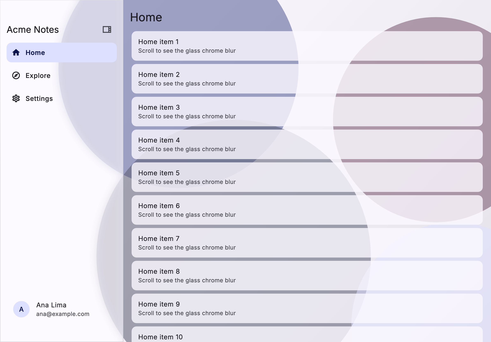 |  |
| Dark | 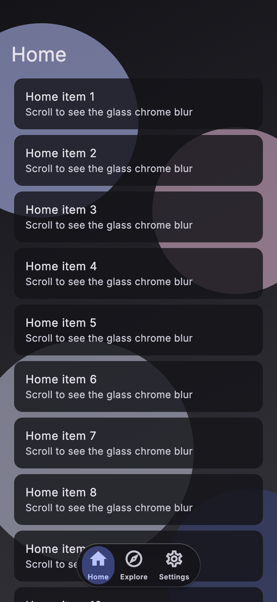 | 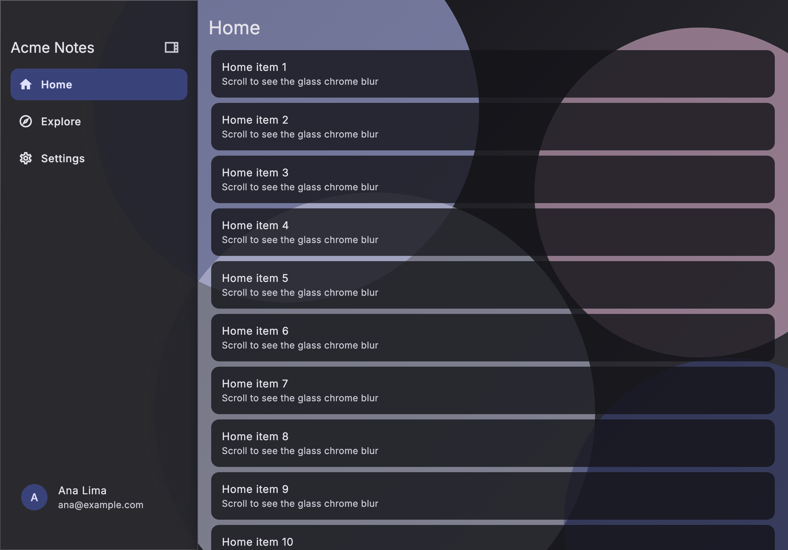 | 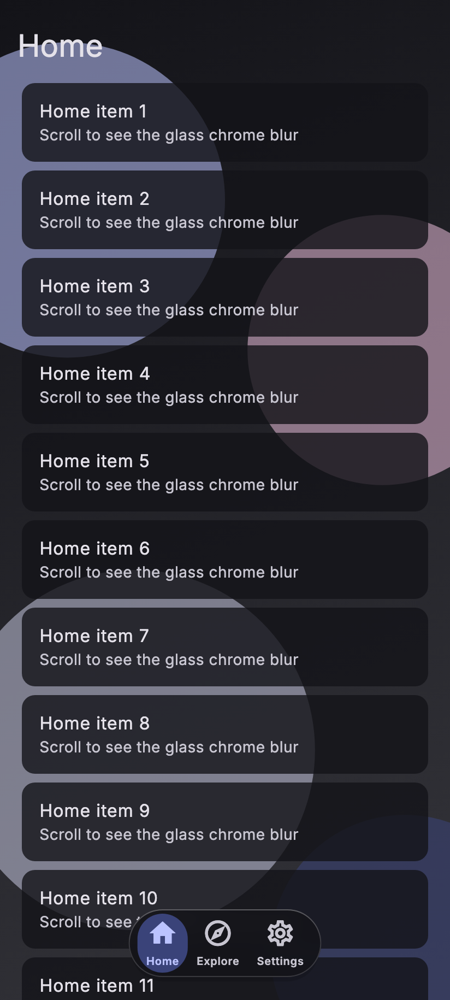 |

## Features

- **One shell, every width.** A bottom glass pill below 700pt; a glass
  sidebar from 700pt, over the content in portrait and beside it in
  landscape from 1024pt, with a top pill and a toggle while it is hidden.
- **Router-agnostic.** You pass `selectedIndex`, `onDestinationSelected` and
  a `body`. Works with `IndexedStack`, `Navigator` or any router.
- **Badges**, **sidebar-only destinations**, **sidebar header and footer**,
  a **trailing action** (for example search) and an async **"Discard
  changes?" guard**.
- **Per-tab state survives** sidebar toggles, rotation and size changes: the
  body is never rebuilt under a new parent.
- **Narrow windows.** Down to 320pt (Slide Over, ⅓ Split View, small
  phones), 5 tabs plus a trailing action keep 44pt-wide cells at text
  scale 1, and the labels shrink to fit.
- **Glass tiers** (liquid, frosted, solid) behind a `LiquidGlassRenderer`
  seam, with automatic **solid fallback** for Reduce Transparency, battery
  saver, disabled window blurs and devices that cannot blur.
- **Accessible**: semantics, large-text icon-only cells with a large content
  viewer, RTL, and every string replaceable through `LiquidShellStrings`.
- Runtime dependencies: Flutter and this plugin's own packages only.

| Platform | Look | Signals |
|---|---|---|
| iOS 15+ | Glass pill and sidebar | Reduce Transparency |
| Android | Same as iOS | Animations off / high contrast, battery saver, window blurs disabled (API 31+), no Impeller |
| Web, macOS, Windows, Linux | Frosted glass | None (always frosted unless forced) |

## Install

```sh
flutter pub add liquid_shell
```

Requires Flutter 3.38 or later.

## Quickstart

A whole app: replace `lib/main.dart` of a new `flutter create` project with
it and run.

<?code-excerpt "quickstart.dart (quickstart)"?>
```dart
import 'package:flutter/material.dart';
import 'package:liquid_shell/liquid_shell.dart';

void main() => runApp(const MaterialApp(home: _Tabs()));

class _Tabs extends StatefulWidget {
  const _Tabs();
  @override
  State<_Tabs> createState() => _TabsState();
}

class _TabsState extends State<_Tabs> {
  int _index = 0;
  @override
  Widget build(BuildContext context) => LiquidShell(
    destinations: const [
      LiquidDestination(icon: Icon(Icons.home), label: 'Home'),
      LiquidDestination(icon: Icon(Icons.settings), label: 'Settings'),
    ],
    selectedIndex: _index,
    onDestinationSelected: (i) => setState(() => _index = i),
    body: Center(child: Text('Tab ${_index + 1}')),
  );
}
```

Pad your pages with `LiquidShellScope.contentPaddingOf(context)` so content
scrolls under the glass but starts and ends clear of it.

Destination labels must be unique (a debug assert names any repeats). Put
the shell inside a route, for example `MaterialApp.home` or a router's shell
route, not in `MaterialApp.builder`: its tooltips need an `Overlay`.

## Cases

Every case is a screen in [`example/`](example/lib/cases). Each snippet is
the inside of that screen's `State` class and compiles on its own: paste it
into the `State` of a new `StatefulWidget` in a file that imports

```dart
import 'package:flutter/material.dart';
import 'package:liquid_shell/liquid_shell.dart';
```

`DemoPage` and `kDemoDestinations` stand in for your own pages and
destinations; they are in
[`example/lib/support/demo_page.dart`](example/lib/support/demo_page.dart).
Each snippet is checked against its source in CI, and each image is a golden
test.

### Three tabs over an `IndexedStack`

The quickstart with real pages. An `IndexedStack` keeps every tab's state
(scroll position, text fields) while another tab is shown.

<?code-excerpt "basic_tabs.dart (readme)"?>
```dart
int _index = 0;

@override
Widget build(BuildContext context) {
  return LiquidShell(
    destinations: const [
      LiquidDestination(icon: Icon(Icons.home_outlined), label: 'Home'),
      LiquidDestination(icon: Icon(Icons.explore_outlined), label: 'Explore'),
      LiquidDestination(
        icon: Icon(Icons.settings_outlined),
        label: 'Settings',
      ),
    ],
    selectedIndex: _index,
    onDestinationSelected: (i) => setState(() => _index = i),
    body: IndexedStack(
      index: _index,
      children: const [
        DemoPage(title: 'Home'),
        DemoPage(title: 'Explore'),
        DemoPage(title: 'Settings'),
      ],
    ),
  );
}
```


### Badges

<?code-excerpt "badges.dart (readme)"?>
```dart
int _index = 0;

@override
Widget build(BuildContext context) {
  const destinations = [
    LiquidDestination(
      icon: Icon(Icons.inbox_outlined),
      label: 'Inbox',
      badge: LiquidBadge.count(3),
    ),
    LiquidDestination(
      icon: Icon(Icons.forum_outlined),
      label: 'Chats',
      badge: LiquidBadge.count(120), // shows "99+"
    ),
    LiquidDestination(
      icon: Icon(Icons.notifications_outlined),
      label: 'Alerts',
      badge: LiquidBadge.dot(),
    ),
  ];
  return LiquidShell(
    destinations: destinations,
    selectedIndex: _index,
    onDestinationSelected: (i) => setState(() => _index = i),
    body: DemoPage(title: destinations[_index].label),
  );
}
```

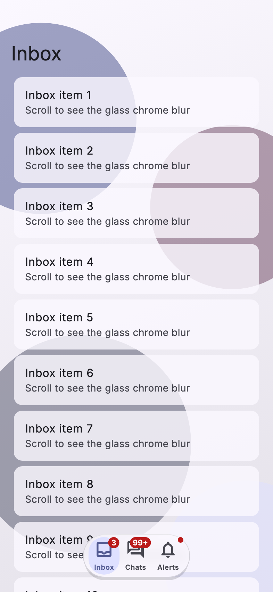

### Sidebar-only destinations

`LiquidPlacement.sidebarOnly` destinations never appear in the tab bar. When
one is selected and the layout becomes compact, the shell calls
`onSelectedDestinationHidden` once so you can move elsewhere.

<?code-excerpt "sidebar_only.dart (readme)"?>
```dart
int _index = 0;

@override
Widget build(BuildContext context) {
  return LiquidShell(
    destinations: const [
      ...kDemoDestinations,
      LiquidDestination(
        icon: Icon(Icons.bar_chart),
        label: 'Reports',
        placement: LiquidPlacement.sidebarOnly,
      ),
      LiquidDestination(
        icon: Icon(Icons.archive_outlined),
        label: 'Archive',
        placement: LiquidPlacement.sidebarOnly,
      ),
    ],
    selectedIndex: _index,
    onDestinationSelected: (i) => setState(() => _index = i),
    // Phones have no sidebar: fall back to the first tab.
    onSelectedDestinationHidden: (_) => setState(() => _index = 0),
    body: DemoPage(title: 'Destination ${_index + 1}'),
  );
}
```

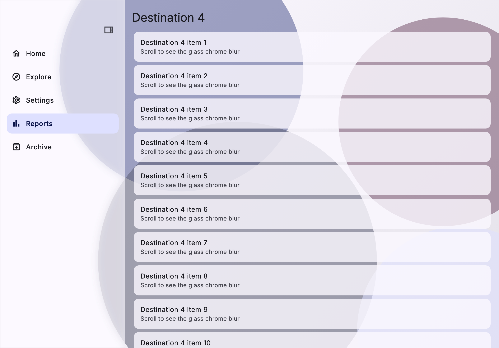

### Sidebar header and footer

<?code-excerpt "sidebar_slots.dart (readme)"?>
```dart
int _index = 0;

@override
Widget build(BuildContext context) {
  final theme = Theme.of(context);
  return LiquidShell(
    destinations: kDemoDestinations,
    selectedIndex: _index,
    onDestinationSelected: (i) => setState(() => _index = i),
    sidebarHeader: Text('Acme Notes', style: theme.textTheme.titleLarge),
    sidebarFooter: const ListTile(
      leading: CircleAvatar(child: Text('A')),
      title: Text('Ana Lima'),
      subtitle: Text('ana@example.com'),
    ),
    body: DemoPage(title: kDemoDestinations[_index].label),
  );
}
```


### Trailing action

The action is a separate glass circle at the end of the tab bar, and the
first row of the sidebar while the sidebar is shown. The search page sits
above the shell, so it wraps itself in `LiquidNoChrome` (see
[Hide the chrome, or none at all](#hide-the-chrome-or-none-at-all)).

<?code-excerpt "trailing_action.dart (readme)"?>
```dart
int _index = 0;

@override
Widget build(BuildContext context) {
  return LiquidShell(
    destinations: kDemoDestinations,
    selectedIndex: _index,
    onDestinationSelected: (i) => setState(() => _index = i),
    tabBarTrailing: LiquidTabAction(
      icon: const Icon(Icons.search),
      semanticLabel: 'Search',
      onPressed: () => Navigator.of(context).push(
        MaterialPageRoute<void>(builder: _searchPage),
      ),
    ),
    body: DemoPage(title: kDemoDestinations[_index].label),
  );
}

// Pushed above the shell (on the app's navigator): no chrome covers it.
Widget _searchPage(BuildContext context) => const LiquidNoChrome(
  child: Scaffold(
    body: DemoPage(
      title: 'Search',
      children: [TextField(decoration: InputDecoration(hintText: 'Find'))],
    ),
  ),
);
```

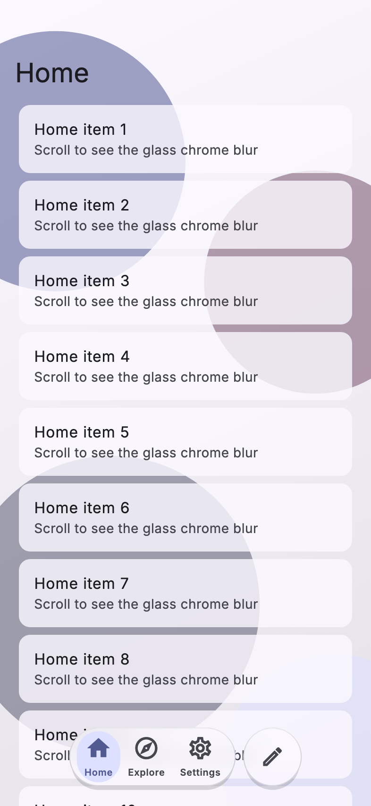

### "Discard changes?" guard

`beforeDestinationChange` runs before every user selection, reselect
included. Return `false` (or throw) to stay. Taps while it is pending are
ignored.

<?code-excerpt "discard_guard.dart (readme)"?>
```dart
int _index = 0;
bool _dirty = true;

Future<bool> _confirmLeave(int index) async {
  if (!_dirty || index == _index) return true;
  final discard = await showDialog<bool>(
    context: context,
    builder: (context) => AlertDialog(
      title: const Text('Discard changes?'),
      actions: [
        TextButton(
          onPressed: () => Navigator.pop(context, false),
          child: const Text('Keep editing'),
        ),
        TextButton(
          onPressed: () => Navigator.pop(context, true),
          child: const Text('Discard'),
        ),
      ],
    ),
  );
  return discard ?? false;
}

@override
Widget build(BuildContext context) => LiquidShell(
  destinations: kDemoDestinations,
  selectedIndex: _index,
  beforeDestinationChange: _confirmLeave,
  onDestinationSelected: (i) => setState(() {
    if (i != _index) _dirty = false;
    _index = i;
  }),
  body: DemoPage(
    title: kDemoDestinations[_index].label,
    children: [
      SwitchListTile(
        title: const Text('Unsaved changes'),
        value: _dirty,
        onChanged: (value) => setState(() => _dirty = value),
      ),
    ],
  ),
);
```

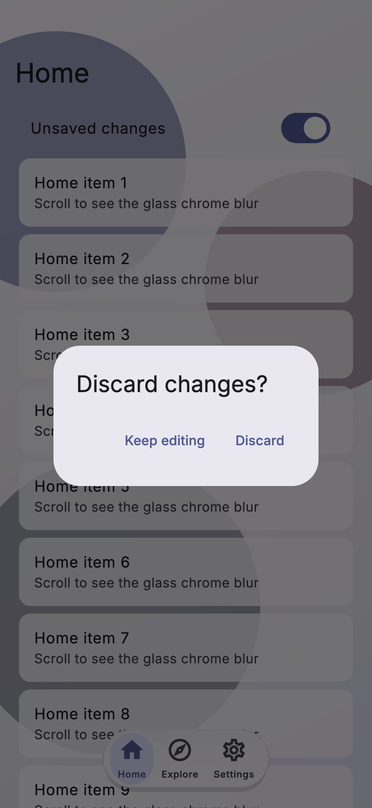

### Hide the chrome, or none at all

A full-frame page pushed **inside** a branch hides every piece of chrome
while it is mounted. The branch needs its own `Navigator` under the shell,
as a router's shell branch has: `LiquidHideChrome` finds the shell above it,
and a page on the app's navigator is not under the shell.

<?code-excerpt "hide_chrome.dart (readme)"?>
```dart
static const _rootKey = ValueKey<String>('root');
static const _detailKey = ValueKey<String>('detail');
final _branchKey = GlobalKey<NavigatorState>();
int _index = 0;
bool _detailOpen = false;

@override
Widget build(BuildContext context) => LiquidShell(
  destinations: kDemoDestinations,
  selectedIndex: _index,
  onDestinationSelected: (i) => setState(() {
    _index = i;
    _detailOpen = false;
  }),
  body: _branch(),
);

// The branch has its own navigator, as a router's shell branch does. The
// detail page is pushed inside it, under the shell, which is where
// LiquidHideChrome reaches the shell. System back pops it first.
Widget _branch() => NavigatorPopHandler(
  onPopWithResult: (_) => _branchKey.currentState?.maybePop(),
  child: Navigator(
    key: _branchKey,
    pages: [
      MaterialPage<void>(
        key: _rootKey,
        child: DemoPage(
          title: kDemoDestinations[_index].label,
          children: [
            ListTile(
              title: const Text('Open a full-frame detail page'),
              trailing: const Icon(Icons.chevron_right),
              onTap: () => setState(() => _detailOpen = true),
            ),
          ],
        ),
      ),
      if (_detailOpen)
        const MaterialPage<void>(
          key: _detailKey,
          // Full frame: every piece of chrome hides while it is mounted.
          child: LiquidHideChrome(
            child: Scaffold(body: DemoPage(title: 'Detail')),
          ),
        ),
    ],
    onDidRemovePage: (page) {
      if (page.key == _detailKey) setState(() => _detailOpen = false);
    },
  ),
);
```

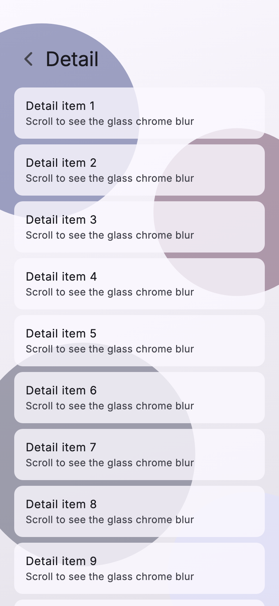

A page pushed **above** the shell (on the app's navigator) is not covered by
the chrome. `LiquidNoChrome` tells its content so, and
`LiquidShellScope.contentPaddingOf` then pads only for the system insets.
This is the search page of the trailing-action snippet:

<?code-excerpt "trailing_action.dart (no-chrome)"?>
```dart
// Pushed above the shell (on the app's navigator): no chrome covers it.
Widget _searchPage(BuildContext context) => const LiquidNoChrome(
  child: Scaffold(
    body: DemoPage(
      title: 'Search',
      children: [TextField(decoration: InputDecoration(hintText: 'Find'))],
    ),
  ),
);
```

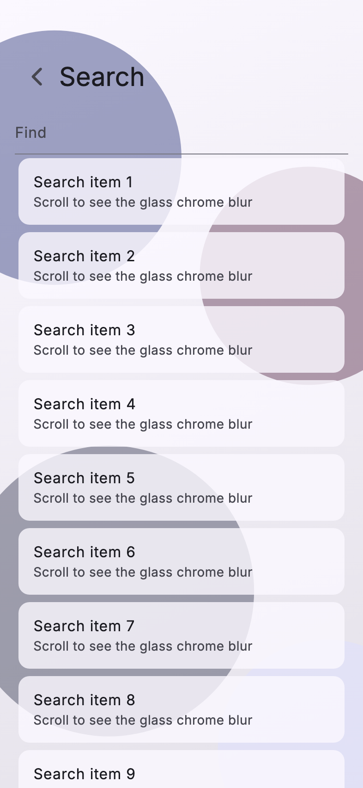

### Custom chrome

`chromeBuilder` receives the chrome the shell would draw. Wrap it, or ignore
it and draw your own; the shell still places and measures the slot, so
`chromeInsets` follow your bar, and a bar that collapses to 0pt adds no
inset. `LiquidTabBar` and `LiquidSidebar` are public for building your own
(see [Standalone tab bar and sidebar](#standalone-tab-bar-and-sidebar)).

<?code-excerpt "custom_chrome.dart (readme)"?>
```dart
int _index = 0;

@override
Widget build(BuildContext context) => LiquidShell(
  destinations: kDemoDestinations,
  selectedIndex: _index,
  onDestinationSelected: (i) => setState(() => _index = i),
  chromeBuilder: _chrome,
  body: DemoPage(title: kDemoDestinations[_index].label),
);

Widget _chrome(
  BuildContext context,
  LiquidChromeDetails details,
  Widget defaultChrome,
) {
  if (details.slot == LiquidChromeSlot.tabBar) {
    // Wrap: a caption above the default bar.
    final scheme = Theme.of(context).colorScheme;
    return Column(
      mainAxisSize: MainAxisSize.min,
      children: [
        DecoratedBox(
          decoration: ShapeDecoration(
            color: scheme.tertiaryContainer,
            shape: const StadiumBorder(),
          ),
          child: const Padding(
            padding: EdgeInsets.symmetric(horizontal: 12, vertical: 4),
            child: Text('Beta'),
          ),
        ),
        const SizedBox(height: 8),
        defaultChrome,
      ],
    );
  }
  // Replace: a plain list instead of the glass sidebar.
  return Material(
    child: ListView(
      // Like LiquidSidebar: leave the route's scroll controller (status-bar
      // tap to top) to the body list.
      primary: false,
      children: [
        for (final i in details.visibleIndices)
          ListTile(
            leading: details.destinations[i].icon,
            title: Text(details.destinations[i].label),
            selected: i == details.selectedIndex,
            onTap: () => details.select(i),
          ),
      ],
    ),
  );
}
```

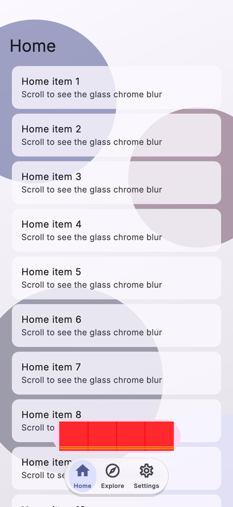

A replacement sidebar list sets `primary: false`, as `LiquidSidebar` does,
so a status-bar tap still scrolls the body. A `LiquidTabBar` you build
yourself decides `narrow` from the window's width; in a shell narrower than
the window, pass `narrow` explicitly (see [Narrow width](#narrow-width)).

Chrome you draw yourself owns its own accessibility: semantics (labels,
selected state, a modal barrier for an overlay sidebar), hit targets of at
least 44pt, and large-text behaviour such as a large content viewer. The
guarantees in [Accessibility and fallbacks](#accessibility-and-fallbacks)
cover only the default chrome, or the parts of it you keep.

### Standalone tab bar and sidebar

`LiquidTabBar` and `LiquidSidebar` work without a `LiquidShell`, in your own
layout. You then own what the shell would do: the bar's outer margins and
its safe area, the switch between bar and sidebar, the content insets, and
system back. Both need a `Directionality` and an `Overlay` above them (for
tooltips and the large-text label viewer): a route of a `MaterialApp` has
both, `MaterialApp.builder` has no `Overlay`. `LiquidTabBar` picks its
narrow padding from the window width; in a pane narrower than the window,
pass `narrow` yourself.

<?code-excerpt "standalone_widgets.dart (readme)"?>
```dart
int _index = 0;

// Both widgets need a Directionality and an Overlay above them (tooltips,
// the large-text label viewer). A route of a MaterialApp has both;
// MaterialApp.builder, above the Navigator, has no Overlay.
@override
Widget build(BuildContext context) {
  final page = DemoPage(title: kDemoDestinations[_index].label);
  void select(int index) => setState(() => _index = index);
  if (MediaQuery.sizeOf(context).width >= 700) {
    return Scaffold(
      body: Row(
        children: [
          LiquidSidebar(
            destinations: kDemoDestinations,
            selectedIndex: _index,
            onDestinationSelected: select,
            header: Text(
              'Acme Notes',
              style: Theme.of(context).textTheme.titleLarge,
            ),
          ),
          Expanded(child: page),
        ],
      ),
    );
  }
  return Scaffold(
    // The page scrolls under the floating bar; Scaffold pads it clear.
    extendBody: true,
    body: page,
    bottomNavigationBar: SafeArea(
      top: false,
      // The bar draws the row only: the margins are yours.
      minimum: const EdgeInsets.fromLTRB(16, 0, 16, 16),
      child: Center(
        heightFactor: 1,
        child: LiquidTabBar(
          destinations: kDemoDestinations,
          selectedIndex: _index,
          onDestinationSelected: select,
        ),
      ),
    ),
  );
}
```

| Phone: `LiquidTabBar` | Wide window: `LiquidSidebar` |
|---|---|
| 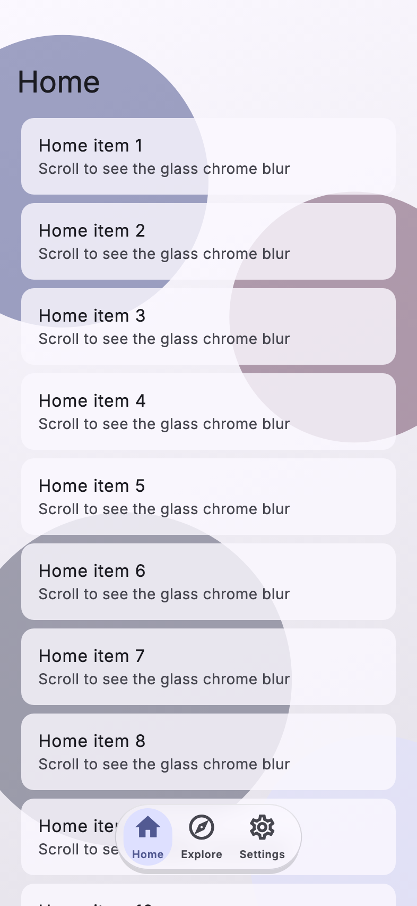 | 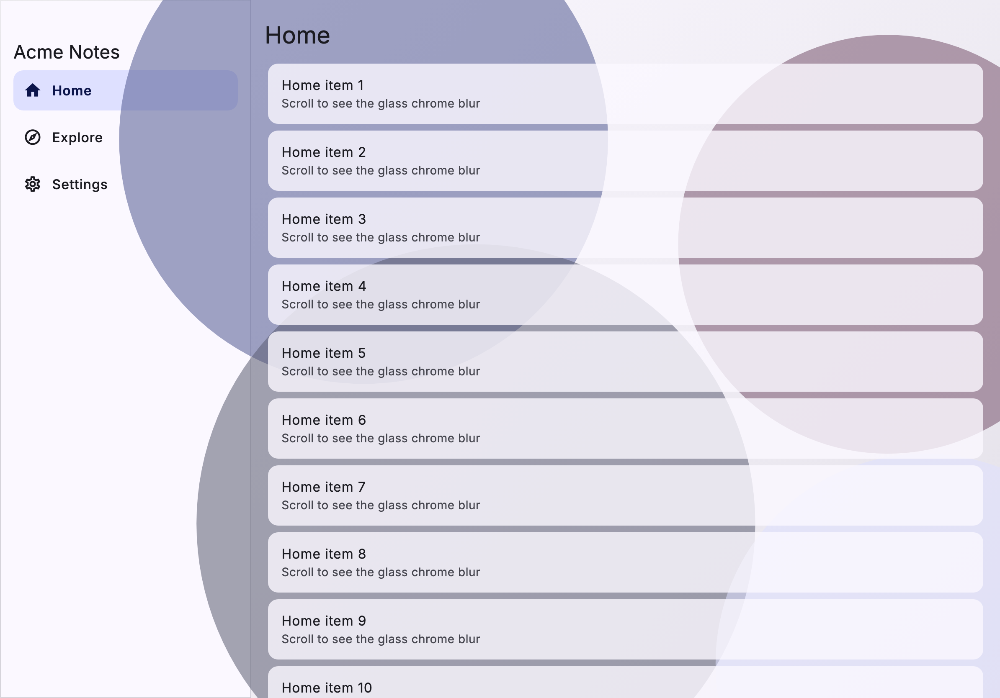 |

### Custom theme

<?code-excerpt "custom_theme.dart (readme)"?>
```dart
int _index = 0;
Brightness _brightness = Brightness.light;

@override
Widget build(BuildContext context) {
  final scheme = ColorScheme.fromSeed(
    seedColor: const Color(0xFF00897B),
    brightness: _brightness,
  );
  final glass = LiquidGlassTheme.fromColorScheme(scheme).copyWith(
    tint: scheme.primaryContainer.withValues(alpha: 0.6),
    blurSigma: 18,
    labelStyle: const TextStyle(
      fontSize: 11,
      height: 1.3,
      fontWeight: FontWeight.w700,
    ),
  );
  final theme = ThemeData(colorScheme: scheme, extensions: [glass]);
  return Theme(
    data: theme,
    child: LiquidShell(
      destinations: kDemoDestinations,
      selectedIndex: _index,
      onDestinationSelected: (i) => setState(() => _index = i),
      body: DemoPage(
        title: 'Brand glass',
        children: [
          SwitchListTile(
            title: const Text('Dark'),
            value: _brightness == Brightness.dark,
            onChanged: (dark) => setState(
              () => _brightness = dark ? Brightness.dark : Brightness.light,
            ),
          ),
        ],
      ),
    ),
  );
}
```

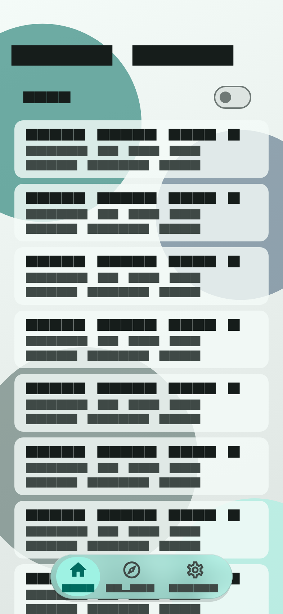

See [doc/theming.md](doc/theming.md) for every field and its default.

### Forced tier

<?code-excerpt "forced_tier.dart (readme)"?>
```dart
int _index = 0;
LiquidGlassTier _tier = LiquidGlassTier.frosted;

@override
Widget build(BuildContext context) {
  return LiquidGlassScope(
    policy: LiquidGlassPolicy(forcedTier: _tier),
    child: LiquidShell(
      destinations: kDemoDestinations,
      selectedIndex: _index,
      onDestinationSelected: (i) => setState(() => _index = i),
      body: DemoPage(
        title: 'Forced tier',
        children: [
          SegmentedButton<LiquidGlassTier>(
            segments: [
              for (final tier in LiquidGlassTier.values)
                ButtonSegment(value: tier, label: Text(tier.name)),
            ],
            selected: {_tier},
            onSelectionChanged: (s) => setState(() => _tier = s.single),
          ),
          if (_tier == LiquidGlassTier.liquid)
            const Text('No liquid renderer is registered: drawing frosted.'),
        ],
      ),
    ),
  );
}
```

| Frosted | Solid |
|---|---|
| 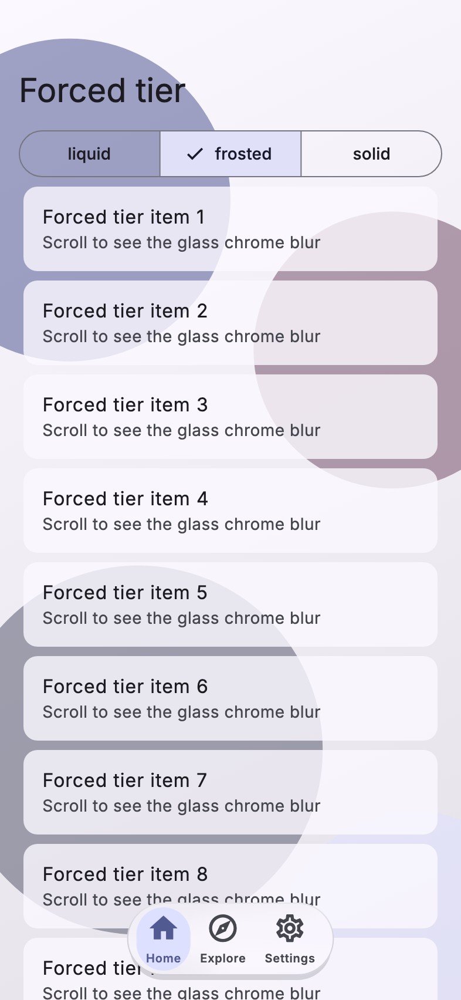 | 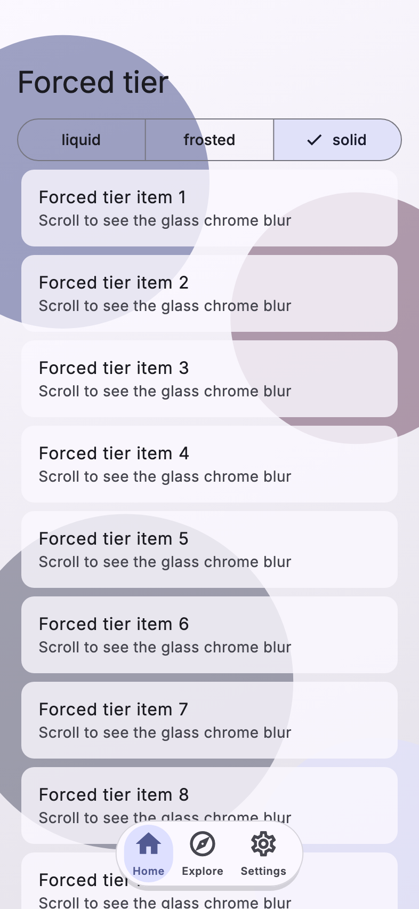 |

No liquid renderer ships yet; forcing `liquid` draws frosted. See
[doc/tiers.md](doc/tiers.md).

### Form factors

The example's form-factor screen puts the basic shell in fixed device frames
with this helper:

<?code-excerpt "form_factors.dart (readme)"?>
```dart
/// [child] laid out as on a device of logical [size] with safe-area
/// [padding], then scaled to the width it is given.
Widget _inFrame(
  BuildContext context,
  Size size,
  EdgeInsets padding,
  Widget child,
) => AspectRatio(
  aspectRatio: size.aspectRatio,
  child: FittedBox(
    child: SizedBox.fromSize(
      size: size,
      child: MediaQuery(
        data: MediaQuery.of(context).copyWith(
          size: size,
          padding: padding,
          viewPadding: padding,
        ),
        child: child,
      ),
    ),
  ),
);
```

| iPhone | Android | iPad portrait | iPad portrait, sidebar open | iPad landscape |
|---|---|---|---|---|
|  | 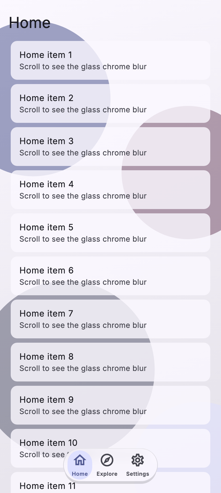 | 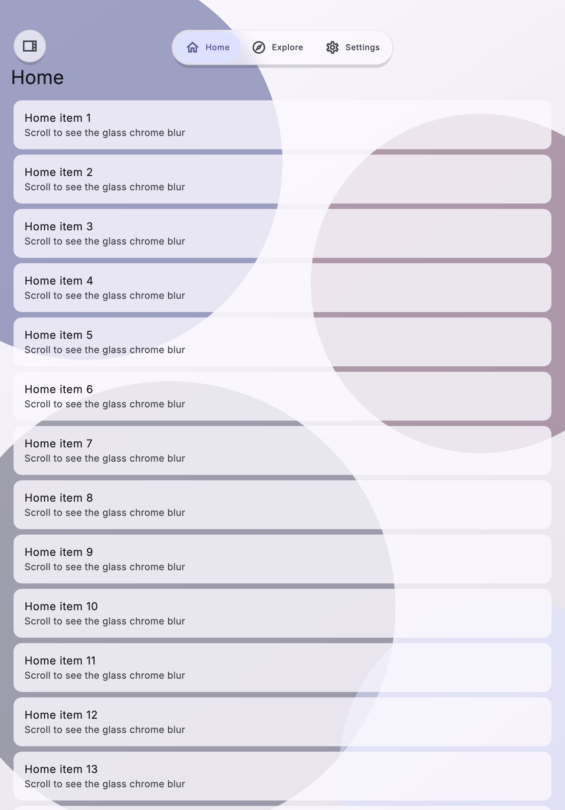 | 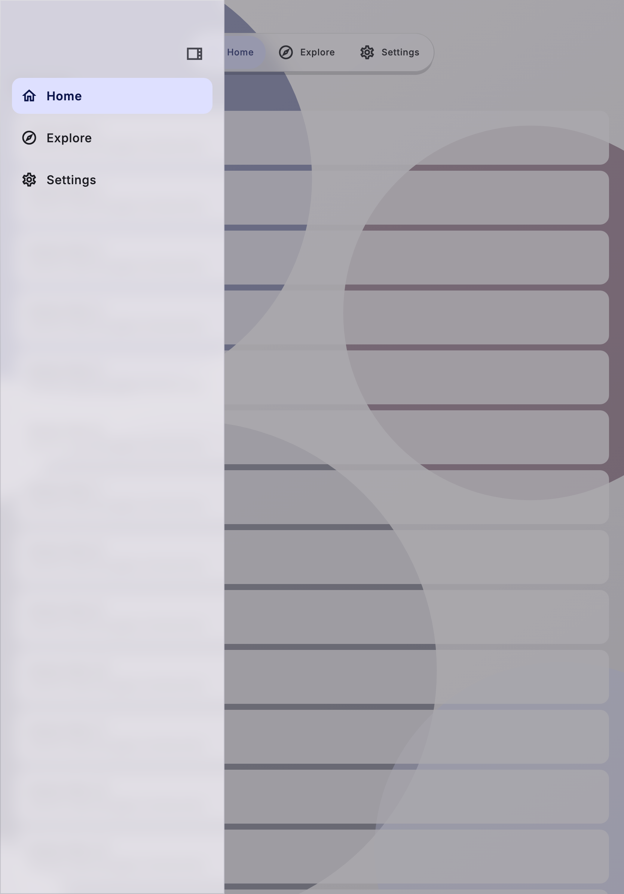 | 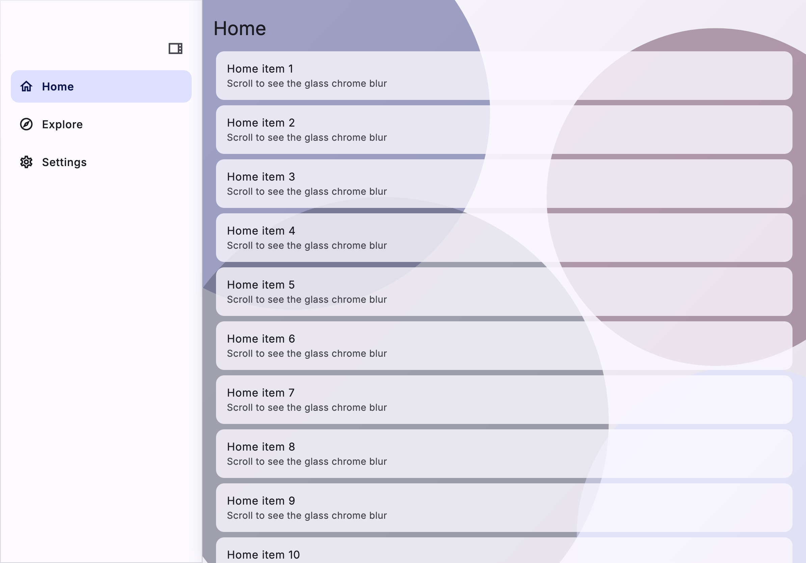 |

### Narrow width

Below `kLiquidNarrowWidth` (340pt of the shell's own width) the bottom row
margin drops from 16 to 8 and the pill padding from 8 to 4. Five tabs plus a
trailing action at 320pt then get 45.2pt cells at text scale 1, above the
44pt minimum hit target. A label that still does not fit takes its cell's
side padding, then shrinks, never below 10pt, and only then ends in an
ellipsis.

<?code-excerpt "narrow_width.dart (readme)"?>
```dart
int _index = 0;

@override
Widget build(BuildContext context) {
  const destinations = [
    LiquidDestination(icon: Icon(Icons.home_outlined), label: 'Home'),
    LiquidDestination(icon: Icon(Icons.explore_outlined), label: 'Explore'),
    LiquidDestination(icon: Icon(Icons.inbox_outlined), label: 'Inbox'),
    LiquidDestination(icon: Icon(Icons.bookmark_outline), label: 'Saved'),
    LiquidDestination(icon: Icon(Icons.settings_outlined), label: 'Settings'),
  ];
  return ColoredBox(
    color: Theme.of(context).colorScheme.surfaceContainerLowest,
    child: Center(
      // The 320pt shell stands for a narrow window, which clips what it
      // draws.
      child: ClipRect(
        child: SizedBox(
          width: 320, // below kLiquidNarrowWidth (340)
          child: LiquidShell(
            destinations: destinations,
            selectedIndex: _index,
            onDestinationSelected: (i) => setState(() => _index = i),
            tabBarTrailing: LiquidTabAction(
              icon: const Icon(Icons.search),
              semanticLabel: 'Search',
              onPressed: () => Navigator.of(context).push(
                MaterialPageRoute<void>(
                  builder: (_) => const LiquidNoChrome(
                    child: Scaffold(body: DemoPage(title: 'Search')),
                  ),
                ),
              ),
            ),
            body: DemoPage(
              title: destinations[_index].label,
              children: const [
                Text(
                  'This shell is 320pt wide, below kLiquidNarrowWidth '
                  '(340): row margin 8, pill padding 4, 45.2pt cells.',
                ),
                SizedBox(height: 12),
              ],
            ),
          ),
        ),
      ),
    ),
  );
}
```

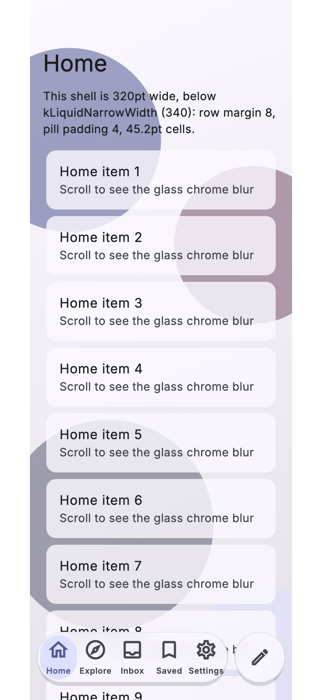

Trade-off: between text scale 1 and 1.6 a narrow bar's labels can shrink
below the size the user chose, down to 10pt. The icon-only cells and the
large content viewer only start at 1.6. Larger text also grows the pill and
the trailing circle, so cells can drop under 44pt there.

## Layout rules

Widths are the shell's own constraints, so Split View, freeform windows and
tests behave correctly.

| Layout | When | Sidebar | Tab bar |
|---|---|---|---|
| Compact | width < 700 | never | bottom pill (narrow margins below 340) |
| Regular, overlay | width ≥ 700, portrait or narrower than 1024 | hidden by default; covers the content when shown | top pill + toggle |
| Regular, tiled | width ≥ 1024 and landscape | shown by default, beside the content | none while shown; top pill + toggle when hidden |
| Hidden | a `LiquidHideChrome` is mounted | none | none |

Change the thresholds with `LiquidShellBreakpoints`. Read the current
layout, insets and sidebar state with `LiquidShellScope.of(context)`.

## Accessibility and fallbacks

Glass turns solid when any of these is on. A signal that cannot be read
counts as off, so the shell never fails to draw.

| Signal | iOS | Android |
|---|---|---|
| Reduce transparency | Reduce Transparency | Animator duration scale 0, or high contrast (API 34+ contrast, or high-text-contrast) |
| High contrast | Increase Contrast | (reported through reduce transparency) |
| Battery saver | not used | Battery Saver |
| Window blurs disabled | not used | `isCrossWindowBlurEnabled` false (API 31+) |
| Cannot blur | never | No Impeller (Skia, API 28 and lower) |

Cells and rows are buttons with labels, badge text and selected state. From
1.6× text size the bar is icon-only and a long press shows the label large.
The overlay sidebar is modal for screen readers, and while it is open,
system back closes it before anything else.

These guarantees cover the chrome the shell draws. A `chromeBuilder` that
replaces a slot must provide its own semantics, hit targets and large
content viewer (see [Custom chrome](#custom-chrome)).

## Limitations

- **At most 5 tab-bar destinations.** More than 5 `everywhere`
  destinations trip a debug assert; release builds draw them in narrower
  cells. Put the rest in the sidebar with `LiquidPlacement.sidebarOnly`.
- **Narrow labels shrink before large text takes over.** In a narrow bar,
  between text scale 1 and 1.6 a label that does not fit is drawn smaller
  than the size the user chose, down to 10pt. Icon-only cells and the
  large content viewer start at 1.6 (see [Narrow width](#narrow-width)).
- **Back with the overlay sidebar open.** System back closes the overlay
  sidebar first, but the route still calls your own `PopScope` handlers
  with `didPop: false`. A handler that shows a dialog should return early
  while `chromeKind` is `LiquidChromeKind.sidebarOverlay` (see
  [doc/router_integration.md](doc/router_integration.md#system-back-and-the-overlay-sidebar)).
  How a router such as go_router orders back is not covered yet.
- **Flutter-drawn chrome on iOS 26.** The tab bar and sidebar are drawn by
  Flutter on every platform. Native iOS 26 chrome (`UITabBarController`,
  the iPadOS window controls) comes in P2.
- **No liquid tier yet.** Forcing `LiquidGlassTier.liquid` draws frosted.
  The liquid tier comes in P4 (and a native iOS 26 renderer in P2).
- **Android signals are best effort.** Each one that cannot be read
  counts as off.

## More

- [doc/theming.md](doc/theming.md): `LiquidGlassTheme` fields and defaults
- [doc/tiers.md](doc/tiers.md): tiers, the policy, signals, writing a renderer
- [doc/router_integration.md](doc/router_integration.md): `IndexedStack`,
  `Navigator` and go_router wiring, branch state, hide/no chrome, system
  back, known limits

## Roadmap

- **P2:** native iOS chrome (`UITabBarController` sidebar, iPadOS 26 window
  controls) and a native liquid renderer on iOS 26.
- **P3:** a glass back button and title bar, a search field and a search tab.
- **P4:** the liquid tier on Android, as a `LiquidGlassRenderer` adapter.
- **P5:** a go_router adapter (`StatefulShellRoute` builder, route-driven
  hide chrome).
- **P6:** final docs pass and 0.1.0 on pub.dev.

## License

MIT. See [LICENSE](LICENSE).
