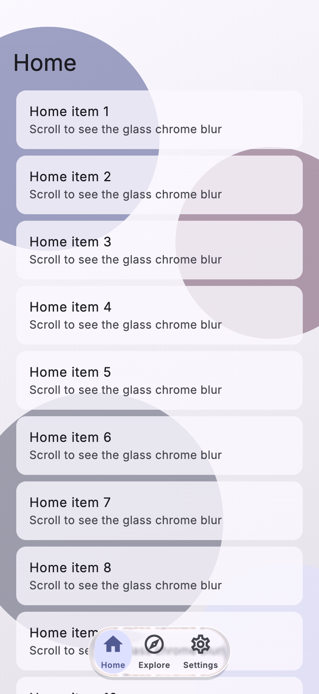

# The liquid tier

`LiquidGlass` draws liquid glass by default wherever Flutter runs on
Impeller (iOS, Android 10+, macOS). The lens is this package's own
fragment shader; no other package is involved.

## What it draws

- **Lens.** Across a 20pt band inside the edge the glass curves down like
  a thick lens. Content under that band is pulled in by up to about 27pt,
  so the band shows a mirrored strip of what lies further inside, as
  iOS 26 glass does; the middle is flat.
- **Specular rim.** A thin highlight, strongest on the top-left edge and
  fainter on the opposite one, plus a soft glow across the band.
- **Dispersion.** Red and blue bend slightly differently in the band, a
  faint colour fringe. `dispersion: 0` turns it off.
- **Blur and tint.** A light blur (σ 2) and the `liquidTint` colour,
  so what lies behind the glass stays recognisable.

A side that touches the screen edge (the sidebar's outer edges) has no
lens and no rim.

## Theme

| Field | Default | Effect |
|---|---|---|
| `liquidTint` | surface @ 40 % (light), 45 % (dark) | Colour over the glass; raise its alpha for more legibility |
| `refraction` | 1 | Lens strength; 0 is flat glass, 2 doubles it |
| `dispersion` | 0.3 | Colour fringe, 0–1 |
| `liquidBlurSigma` | 2 | Blur under the lens; 0 for none |

| `refraction: 0` | default | `refraction: 2` |
|---|---|---|
|  |  |  |

| `dispersion: 0` | default (`dispersion: 0.3`) |
|---|---|
|  |  |

## When it is not drawn

The tier drops to **frosted** without Impeller (Android 9 and lower, the
web), on Android devices without Vulkan 1.1 or with less than 3 GiB of
memory, in battery saver or iOS Low Power Mode, after sustained slow
frames, inside another `BackdropFilter`, and until the shader has loaded.
It drops to **solid** with Reduce Transparency, Increase Contrast, or
window blurs disabled outside battery saver. See [tiers.md](tiers.md).

## First frame

The shader loads when the first `LiquidGlass` mounts; until then glass is
frosted and then cross-fades. To start liquid:

    Future<void> main() async {
      WidgetsFlutterBinding.ensureInitialized();
      await LiquidGlass.precache();
      runApp(const MyApp());
    }

## Cost

All chrome shares one backdrop copy (`BackdropGroup`). Each surface adds a
small blur and one pass of the lens over its own area. Never put glass on
list cells.

In profile and release builds a frame guard watches raster times while
liquid glass is on screen. After three windows of 60 frames in a row whose
90th percentile is above 1.25 × the frame budget (1 s / refresh rate, never
less than 16.7 ms), the glass turns frosted for the rest of the session.

## Provenance

The shader is written from first principles (a rounded-rect distance
field, Snell's law, a Fresnel-like rim). No other glass package's code
was read or copied.
